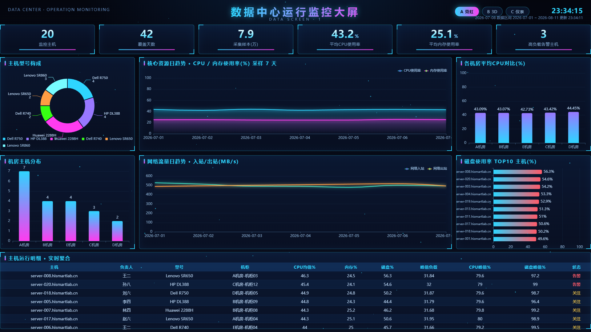
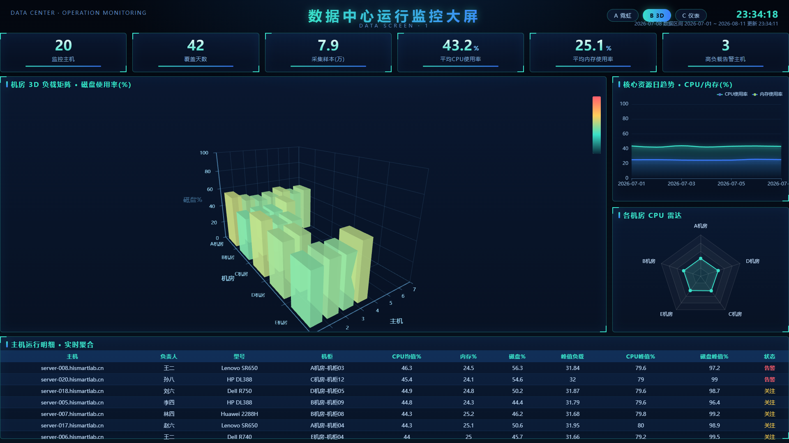
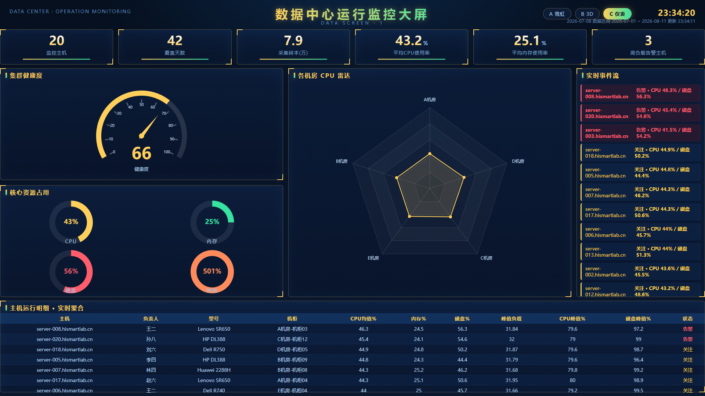

# 数据中心运行监控大屏 · data-screen-1

基于 **ECharts / ECharts-GL** 的实时数据中心运行监控大屏，数据直连 **MySQL**（Docker），前端每 30s 轮询刷新。支持 **三套可视化风格** 一键切换。

## 功能特性

- 实时聚合：监控主机数、覆盖天数、采集样本量、平均 CPU/内存使用率、高负载告警主机数
- 主机运行明细表：CPU/内存/磁盘均值与峰值、峰值负载、运行状态（正常 / 关注 / 告警）
- 三套主题风格，右上角按钮一键切换：

| 风格 | 名称 | 说明 |
| --- | --- | --- |
| A | 霓虹全息 | 主机型号 / 机房分布 / 资源趋势 / 网络流量 / 各机房 CPU / 磁盘 TOP10 |
| B | 3D 空间 | 机房 3D 负载矩阵（磁盘使用率）、资源趋势、各机房 CPU 雷达 |
| C | HUD 仪表 | 集群健康度仪表、核心资源占用环图、CPU 雷达、实时事件流 |

## 预览

### 风格 A · 霓虹全息


### 风格 B · 3D 空间


### 风格 C · HUD 仪表


## 快速开始

### 1. 启动数据源（MySQL）

```bash
docker compose up -d        # data_screen @ 127.0.0.1:3307 (root / root123456)
```

### 2. 启动后端服务

```bash
pip install pymysql
python server.py            # 默认 http://localhost:8000
```

### 3. 打开大屏

浏览器访问 **http://localhost:8000**。

## 项目结构

```
index.html / template.html   前端大屏（双文件保持一致，server.py 实际提供 template.html）
server.py                    后端 HTTP 服务，暴露 /api/dashboard
db_queries.py                MySQL 实时聚合查询
mysql/                       表结构与初始化脚本
aggregate_tool.py / build_dashboard.py / show_summary.py  离线聚合与调试工具
echarts.min.js / echarts-gl.min.js   本地化图表库
```

## 说明

- 后端通过 `GET /api/dashboard` 返回与前端严格一致的 JSON；连接/查询失败会在大屏顶部给出明确提示。
- 三套风格的图表容器按需初始化与销毁，切换时自动重建并适配当前视口。
